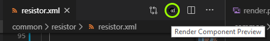
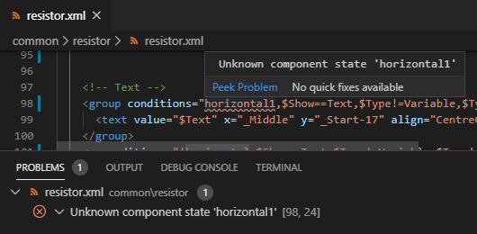
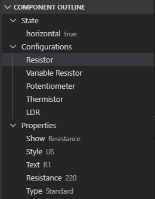
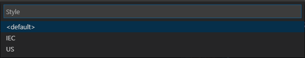

# Circuit Diagram VS Code Extension

[](https://travis-ci.org/circuitdiagram/circuitdiagram-vscode)

A Visual Studio Code extension for creating components for Circuit Diagram.

View instructions for how to create new components using this extension
[here](https://componenteditor.com/help/).

## Features

Provides a _render preview_ button when editing Circuit Diagram component XML files.



Compilation errors will be displayed in the _Problems_ window and highlighted in the
component file.



The _Component Outline_ view shows the properties and configurations for the component.
Click on a configuration to render that configuration.



Click on a property to change the value that is used when rendering a preview.



If your component compiles successfully, a `render.png` file will be produced in the same
directory as your component file and opened in a pane to the right.


## Installation

This project is in development and is not yet available in the VS marketplace. Visit
[circuit-diagram.org](http://www.circuit-diagram.org/downloads) or the
[releases page](https://github.com/circuitdiagram/circuitdiagram-vscode/releases) to
download the latest version.

Manually install the VSIX file in VS Code by going to _Extensions_ -> _Install from
VSIX_. The extension cannot be installed by double clicking on the VSIX file.

This extension requires the Circuit Diagram command-line application to render
components. You must [download](http://www.circuit-diagram.org/downloads) the appropriate
version for your system and configure the path to the downloaded executable in your VS
Code settings.

If the command-line download is an archive file (e.g. zip), you will need to extract it first. See [command line setup](https://www.circuit-diagram.org/help/command-line) for more information.

For example:

```json
{
    "circuitDiagram.executablePath": "C:/Path/To/circuit-diagram-cli.exe"
}
```

## Extension Settings

This extension contributes the following settings:

* `circuitDiagram.executablePath`: path to the Circuit Diagram Command-line executable (required)

* `circuitDiagram.debugLayout`: render component layout information (shown in blue, default `false`)

* `circuitDiagram.executableCommandPrefix`: override render command (advanced use only)
